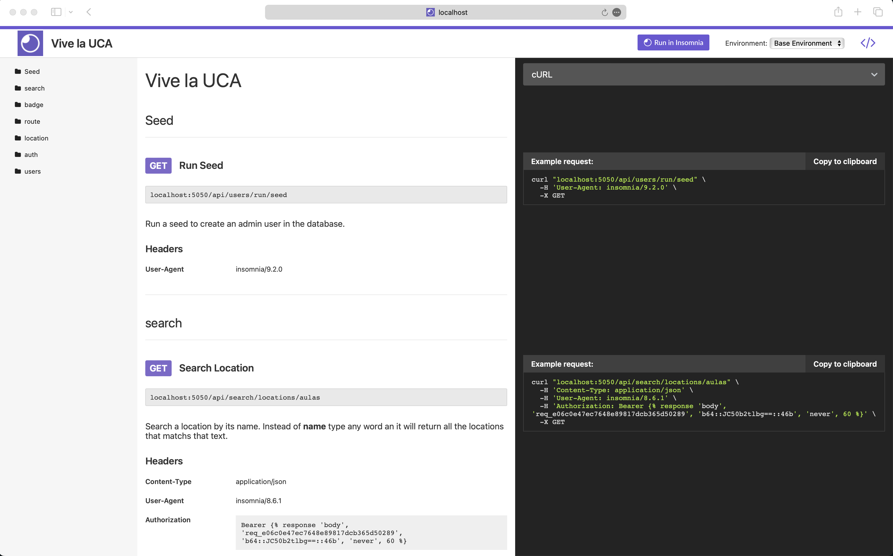
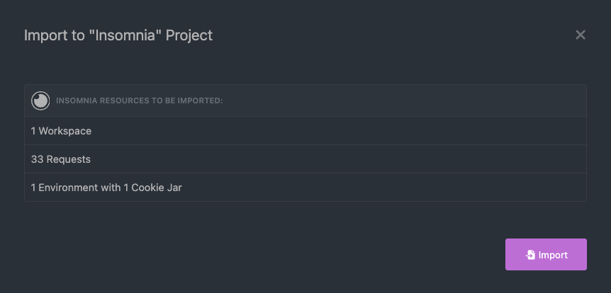

# Vive-la-UCA Backend Project

This project is a backend service built using Node.js and Express, designed to handle various functionalities including file uploads using Multer, and is containerized using Docker for ease of deployment and scalability.

## Table of Contents

- [Prerequisites](#prerequisites)
- [Installation](#installation)

## Prerequisites

Before you begin, ensure you have the following installed:

- [Node.js](https://nodejs.org/en/download/)
- [Docker](https://www.docker.com/products/docker-desktop) (for containerization)
- [Git](https://git-scm.com/downloads) (for cloning the repository)

## Installation

1. Clone the repository:

```bash
git clone https://github.com/Vive-la-UCA/backend.git
cd backend
```

2. Set up environment variables:

Copy `.example.env` to `.env` and update the values as necessary. Ask an administrator for the environment variables.

3. Build and start the Docker container:

```bash
docker-compose build
docker-compose up
```

The name of the container is `admin-back`.

## Usage

To use the backend service, you can make HTTP requests to the various endpoints provided.

If you are running the project in development mode you can see the API documentation in the following path at your web browser `localhost:port/`. The port will be defined on the `.env` file.



Additionally, in the folder `assets` there is a file named `Insomnia_2024-07-30.json`. With the following steps you can import it to you Insomnia application.

1. In the home screen press the `Create` button and choose the `Import` option:


2. Then you can drag or select the `Insomnia_2024-07-30.json` file. And press the `Scan` button.


3. Now, you will check the information that will be imported and press the `Import` button.



4. In the home screen it will be a collection named `Vive la UCA`. Click it to see all the folders and endpoints.


5. Finally, you will have all the information separated by folders and methods so you can test the backend.

